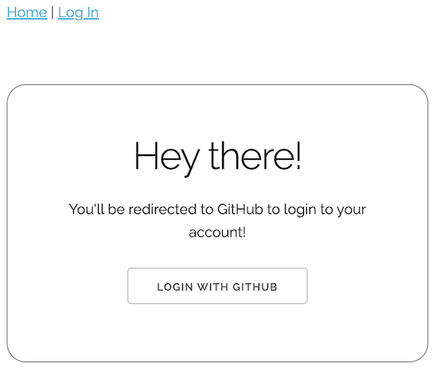
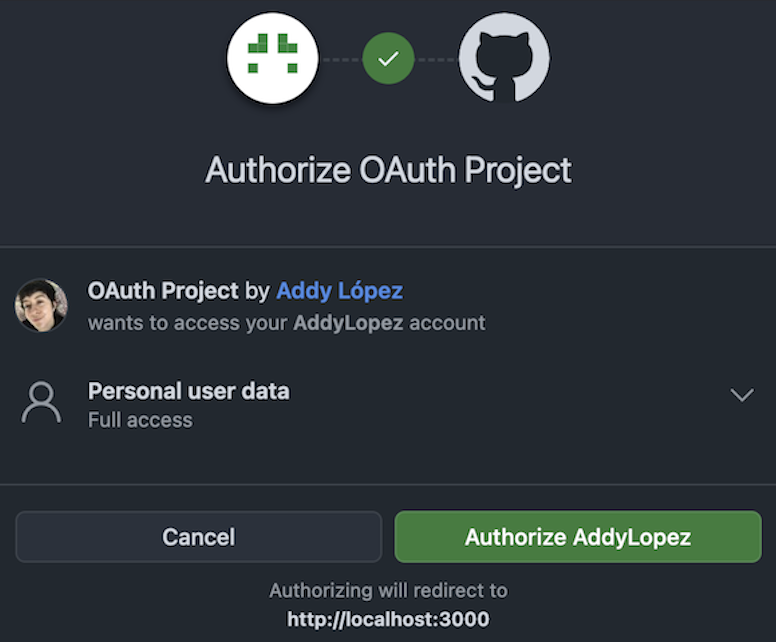
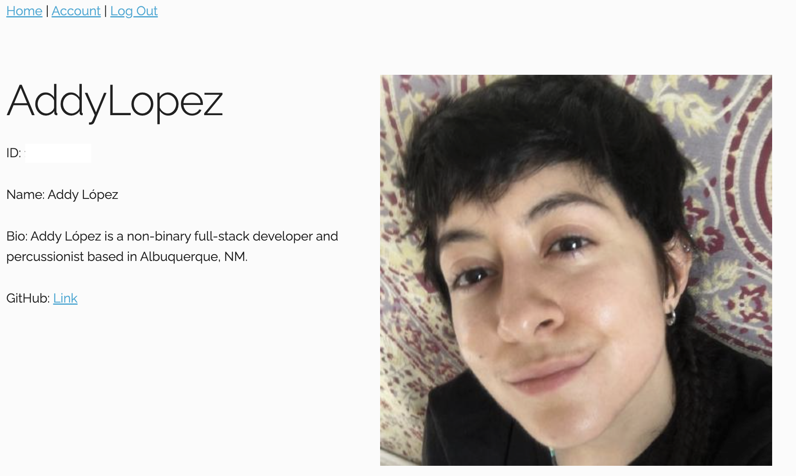

# github-oauth-app

<<<<<<< HEAD
<<<<<<< HEAD
## Description
Codecademy project to learn how to authenticate an application integrating my GitHub account into an OAuth authentication flow.

The project involved registering the application on GitHub, generating a Client ID and Client Secret, setting up an Express session, configuring Passport, serializing and deserializing user instances with Passport, implementing OAuth routes to redirect the user while logging in and out, and finally deleting the Client token in my GitHub developer settings with cybersecurity in mind.

## Technologies
OAuth, GitHub, NodeJS, ExpressJS, Passport

## Project Previews

=======
>>>>>>> parent of 5a3cbd2 (Add Project Previews section and images)
=======
>>>>>>> parent of 5a3cbd2 (Add Project Previews section and images)
